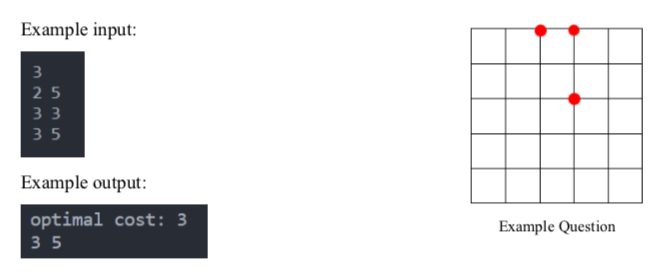

# Linear-Programming
Some basic problems in linear programming

<h3>Problem 1</h3>
Consider the triangle given below. Determine the sides of the triangle using the Pyomo package in such a way that:

1. Maximize the perimeter of the obtained triangle. 

2. Minimize the perimeter of the obtained triangle.

<h3>Problem 2</h3>

You plan to invest $6,000 of your assets. Upon hearing this news, two different people they have given you the opportunity to be a partner in two different entrepreneurs, each run by one of them. Becoming a full partner in the first person's firm requires $5,000 in capital and 400 hours, and your estimated profit (ignoring the value of your time) will be $4,500. This is while the relevant figures for the partnership with the second person are 4000 dollars and 500 hours, the estimated profit of which is 4500 dollars. Both people flexible and allow you to invest in any part of a full partnership that you wish.

If you choose a percentage of a full contribution, all the above figures for a full contribution (cash capital, time capital and your interest) are multiplied by the same percentage. You decide to invest one or both people in whatever combination your total estimated profit is.

The goal is to find the best combination for investment.

<h3>Problem 3</h3>

You are asked to find the best place to build an oline store in such a way that the total distance of customers to this in-person delivery center is minimum.

We assume that the coordinates of each point in the city are displayed as (x,y), where x and y are non-negative integers. Also, the distance between two points (x1,y1) and (x2,y2) is It is calculated as follows:

distance = |𝑦2 − 𝑦1| + |𝑥2 − 𝑥1| 

Program inputs:

In the first line, the number of customers (n) is given to the program. Then, in the next n line, the coordinates (x,y) of each customer are entered.

Program output:

Your program should print the optimal value (the sum of the distances of customers to the center) as well as the optimal coordinates of the in-person delivery center as the output of the program.

<h3>Problem 4</h3>

Solve the shortest distance between origin (A) and destination (E) using linear programming.

